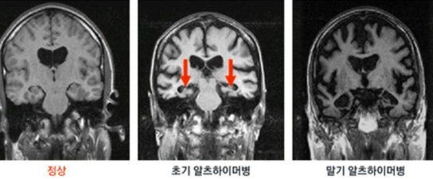

## 빅 데이터 기반 융합 소프트웨어 공모전

 

## 1. 사용 기술

- [Tensorflow](https://github.com/tensorflow/tensorflow)
- Java

 

## 2. 주요 내용

- 뇌 사진을 이용한, 치매 위험성을 판단해 줄 수 있는 프로그램 개발

## 3. 활동 내용

- 사진을 입력받았을 때 기존에 분석된 사진들과 부위별로 비교하여 알츠하이머에 걸린 환자들의 뇌 사진과 얼마나 일치하게 나오는지를 계산하여 위험도 표시

 

> 알츠하이머 병에 걸린 사람들의 뇌 MRI 사진이 정상인과 다른다는 점을 이용하여 이미지 분석

