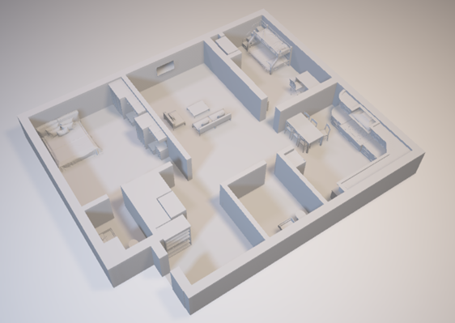
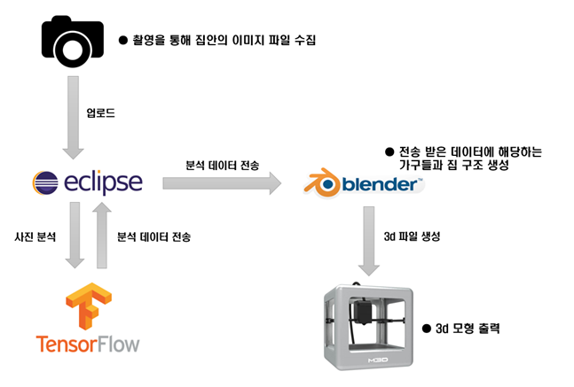
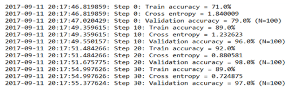
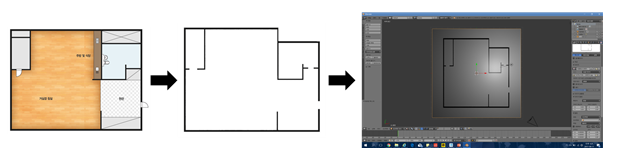
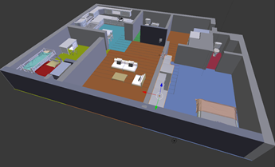

  

## IT대학 소프트웨어 공모전

 

## 사용 기술

- [Blender](https://www.blender.org/) (Python)
- [Tensorflow](https://github.com/tensorflow/tensorflow)
- Java

 

### 시스템 구상도

  

#### Inception v3 모델을 기반으로 Tensorflow retrain

  

#### 선택한 평면도를 인식하여 3d모델링 파일 생성 (Python)

  

#### Blender를 이용하여 가구 배치를 자동으로 진행
